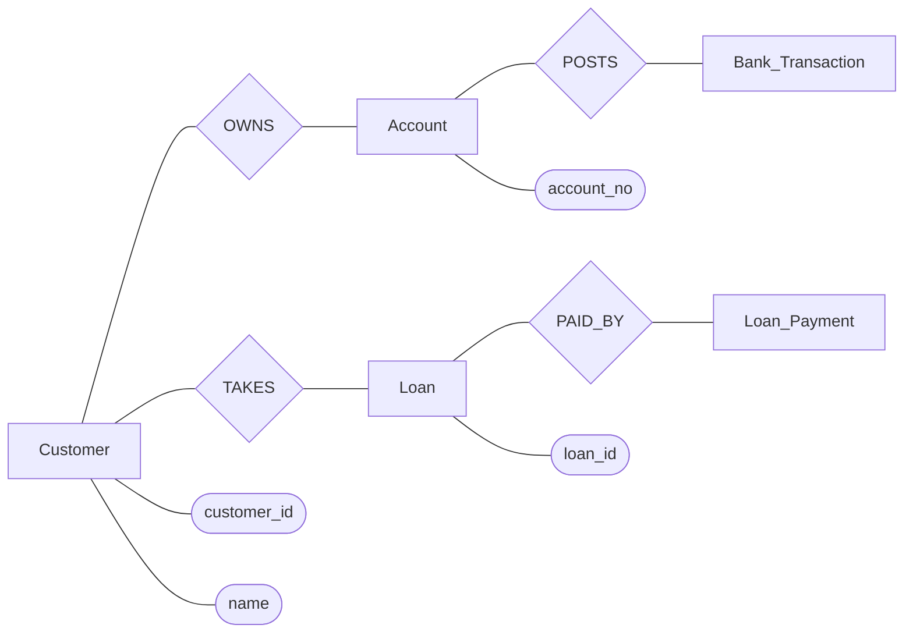

# Banking System: ER Model, Relational Schema, and Normalization

## 1) System Description and Key Functionalities

### Chosen System

This project is a Banking System built with Flask + SQLite. It supports both operational workflows (accounts, transactions, loans, installments) and bank reference views (branches, employees, loan portfolio).

### Key Functionalities from the Codebase

- Customer registration and login with hashed passwords and session management.
- CSRF-protected forms and API write operations.
- Personal dashboard for:
  - creating accounts,
  - updating account type/branch,
  - closing eligible accounts,
  - depositing, withdrawing, transferring funds,
  - applying for loans,
  - paying EMI/installments from selected accounts.
- Bank details dashboard for branch, employee, and loan reference data.
- JSON APIs for summary, accounts, transactions, loans, and loan-payment history.
- Transaction-safe writes with `BEGIN IMMEDIATE`, commit/rollback handling, and FK constraints.

### Business Rules Enforced in Services/Repositories

- Customer can update/close only their own accounts.
- Account close allowed only if balance is zero and no transaction history exists.
- Transfer requires source and target accounts to differ.
- Loan type and transaction type are validated against allowed values.
- Installment payment cannot exceed outstanding loan amount.
- Installment deduction requires sufficient source account balance.

---

## 2) Detailed ER Model

## 2.1 Entities, Attributes, and Primary Keys

### BRANCH

- `branch_id` (PK)
- `branch_name` (Unique)
- `city`
- `assets`
- `created_at`

### CUSTOMER

- `customer_id` (PK)
- `name`
- `address`
- `phone` (Unique)
- `email` (Unique)
- `dob`
- `created_at`

### APP_USER

- `user_id` (PK)
- `username` (Unique)
- `password_hash`
- `customer_id` (FK, Unique)
- `created_at`

### ACCOUNT

- `account_no` (PK)
- `acc_type` (Savings/Current/FD)
- `balance`
- `open_date`
- `branch_id` (FK)
- `customer_id` (FK)

### EMPLOYEE

- `emp_id` (PK)
- `name`
- `designation`
- `salary`
- `branch_id` (FK)
- `created_at`

### LOAN

- `loan_id` (PK)
- `loan_type` (Home/Car/Education/Personal)
- `amount`
- `interest_rate`
- `issue_date`
- `branch_id` (FK)
- `customer_id` (FK)

### BANK_TRANSACTION

- `txn_id` (PK)
- `txn_type` (Deposit/Withdraw/Transfer)
- `amount`
- `txn_datetime`
- `source_account_no` (FK)
- `target_account_no` (FK, nullable)
- `description`

### LOAN_PAYMENT

- `payment_id` (PK)
- `loan_id` (FK)
- `pay_date`
- `amount_paid`

## 2.2 Relationship Summary (Cardinality)

- CUSTOMER 1:1 APP_USER
- CUSTOMER 1:N ACCOUNT
- BRANCH 1:N ACCOUNT
- BRANCH 1:N EMPLOYEE
- CUSTOMER 1:N LOAN
- BRANCH 1:N LOAN
- ACCOUNT 1:N BANK_TRANSACTION (as source account)
- ACCOUNT 0..N BANK_TRANSACTION (as target account, optional)
- LOAN 1:N LOAN_PAYMENT

## 2.3 ER Diagram (Crow's Foot Style)

```mermaid
erDiagram
    BRANCH ||--o{ ACCOUNT : has
    BRANCH ||--o{ EMPLOYEE : employs
    BRANCH ||--o{ LOAN : issues

    CUSTOMER ||--|| APP_USER : authenticates_as
    CUSTOMER ||--o{ ACCOUNT : owns
    CUSTOMER ||--o{ LOAN : borrows

    ACCOUNT ||--o{ BANK_TRANSACTION : source_for
    ACCOUNT o|--o{ BANK_TRANSACTION : target_for

    LOAN ||--o{ LOAN_PAYMENT : repaid_by

    BRANCH {
      int branch_id PK
      string branch_name UK
      string city
      decimal assets
      datetime created_at
    }

    CUSTOMER {
      int customer_id PK
      string name
      string address
      string phone UK
      string email UK
      date dob
      datetime created_at
    }

    APP_USER {
      int user_id PK
      string username UK
      string password_hash
      int customer_id FK UK
      datetime created_at
    }

    ACCOUNT {
      int account_no PK
      string acc_type
      decimal balance
      date open_date
      int branch_id FK
      int customer_id FK
    }

    EMPLOYEE {
      int emp_id PK
      string name
      string designation
      decimal salary
      int branch_id FK
      datetime created_at
    }

    LOAN {
      int loan_id PK
      string loan_type
      decimal amount
      decimal interest_rate
      date issue_date
      int branch_id FK
      int customer_id FK
    }

    BANK_TRANSACTION {
      int txn_id PK
      string txn_type
      decimal amount
      datetime txn_datetime
      int source_account_no FK
      int target_account_no FK
      string description
    }

    LOAN_PAYMENT {
      int payment_id PK
      int loan_id FK
      date pay_date
      decimal amount_paid
    }
```

## 2.4 Chen-Style Shape Reference (Rectangles, Diamonds, Ovals)

- Rectangle = Entity
- Diamond = Relationship
- Oval = Attribute



---

## 3) Relational Schema (From ER Model)

## 3.1 Relations with Keys

- `BRANCH(branch_id PK, branch_name UQ, city, assets, created_at)`
- `CUSTOMER(customer_id PK, name, address, phone UQ, email UQ, dob, created_at)`
- `APP_USER(user_id PK, username UQ, password_hash, customer_id FK UQ -> CUSTOMER.customer_id, created_at)`
- `ACCOUNT(account_no PK, acc_type, balance, open_date, branch_id FK -> BRANCH.branch_id, customer_id FK -> CUSTOMER.customer_id)`
- `EMPLOYEE(emp_id PK, name, designation, salary, branch_id FK -> BRANCH.branch_id, created_at)`
- `LOAN(loan_id PK, loan_type, amount, interest_rate, issue_date, branch_id FK -> BRANCH.branch_id, customer_id FK -> CUSTOMER.customer_id)`
- `BANK_TRANSACTION(txn_id PK, txn_type, amount, txn_datetime, source_account_no FK -> ACCOUNT.account_no, target_account_no FK -> ACCOUNT.account_no NULL, description)`
- `LOAN_PAYMENT(payment_id PK, loan_id FK -> LOAN.loan_id, pay_date, amount_paid)`

## 3.2 Additional Constraints in Schema

- CHECK constraints:
  - `ACCOUNT.acc_type IN ('Savings', 'Current', 'FD')`
  - `ACCOUNT.balance >= 0`
  - `LOAN.loan_type IN ('Home', 'Car', 'Education', 'Personal')`
  - `LOAN.amount > 0`
  - `LOAN.interest_rate BETWEEN 0 AND 100`
  - `BANK_TRANSACTION.txn_type IN ('Deposit', 'Withdraw', 'Transfer')`
  - `BANK_TRANSACTION.amount > 0`
  - `LOAN_PAYMENT.amount_paid > 0`
  - `EMPLOYEE.salary > 0`

- FK delete/update rules:
  - `APP_USER.customer_id -> CUSTOMER.customer_id` with `ON DELETE CASCADE`
  - Most other business tables use `ON DELETE RESTRICT` to preserve integrity
  - `LOAN_PAYMENT.loan_id -> LOAN.loan_id` with `ON DELETE CASCADE`

- Important indexes:
  - `idx_account_customer`, `idx_account_branch`
  - `idx_loan_customer`, `idx_loan_branch`
  - `idx_txn_source`, `idx_txn_target`, `idx_txn_datetime`
  - `idx_payment_loan`

---

## 4) Normalization Analysis (1NF, 2NF, 3NF+)

All relations satisfy 1NF and 2NF (no repeating groups, all atomic columns, no partial dependency issues because primary keys are single-column). The following table shows highest normal form achieved per relation.

| Relation         | 1NF | 2NF | 3NF | BCNF | Highest NF | Why                                                                                                   |
| ---------------- | --- | --- | --- | ---- | ---------- | ----------------------------------------------------------------------------------------------------- |
| BRANCH           | Yes | Yes | Yes | Yes  | BCNF       | All non-trivial dependencies are on candidate keys (`branch_id`, `branch_name`).                      |
| CUSTOMER         | Yes | Yes | Yes | Yes  | BCNF       | Determinants are candidate keys (`customer_id`, `phone`, `email`).                                    |
| APP_USER         | Yes | Yes | Yes | Yes  | BCNF       | Determinants are candidate keys (`user_id`, `username`, `customer_id`).                               |
| ACCOUNT          | Yes | Yes | Yes | Yes  | BCNF       | Main determinant is `account_no`; no transitive dependency among non-key attributes.                  |
| EMPLOYEE         | Yes | Yes | Yes | Yes  | BCNF       | Main determinant is `emp_id`; no functional dependencies among non-key attributes in schema.          |
| LOAN             | Yes | Yes | Yes | Yes  | BCNF       | Main determinant is `loan_id`; business constraints are domain checks, not transitive dependencies.   |
| BANK_TRANSACTION | Yes | Yes | Yes | Yes  | BCNF       | Main determinant is `txn_id`; source/target account references do not create transitive dependencies. |
| LOAN_PAYMENT     | Yes | Yes | Yes | Yes  | BCNF       | Main determinant is `payment_id`; each row stores one atomic installment event.                       |

## 4.1 Why this Design Works Well

- Authentication data is split from customer profile (`APP_USER` vs `CUSTOMER`), reducing redundancy.
- Installment history is isolated in `LOAN_PAYMENT`, avoiding repeating payment columns in `LOAN`.
- Money movement is centralized in `BANK_TRANSACTION`, enabling auditable transaction logs.
- Derived values such as outstanding loan amount are computed via queries, not stored redundantly.

## 4.2 Practical Integrity Beyond Normalization

The codebase also enforces application-level constraints that are intentionally outside pure normalization:

- account closure rule (zero balance + no transaction history),
- installment amount <= outstanding amount,
- account ownership checks for updates, transactions, and EMI deductions.

These rules complement normalized schema design and ensure correct domain behavior.
